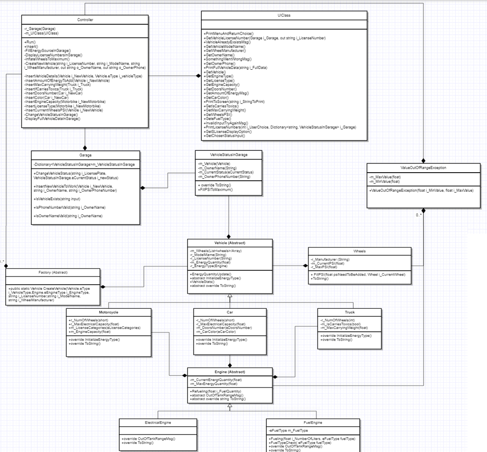

# Garage-management

Development of an OOP driven garage manager console application.
Currently supports Cars, Motorcycles (both fuel and electric) and Trucks.
Each vehicle is wrapping common & unique objects and properties according to its type.
Actions available to the user: 🚗 🏍️ 🚚

1. Adding a vehicle.
2. Changing a vehicle's status.
3. Checking all of the vehicles license numbers that currently in the garage.
4. Refueling a vehicle.
5. Inflating a vehicle's wheels.
6. Display vehicle information.

## Screenshots:
- Uml:

